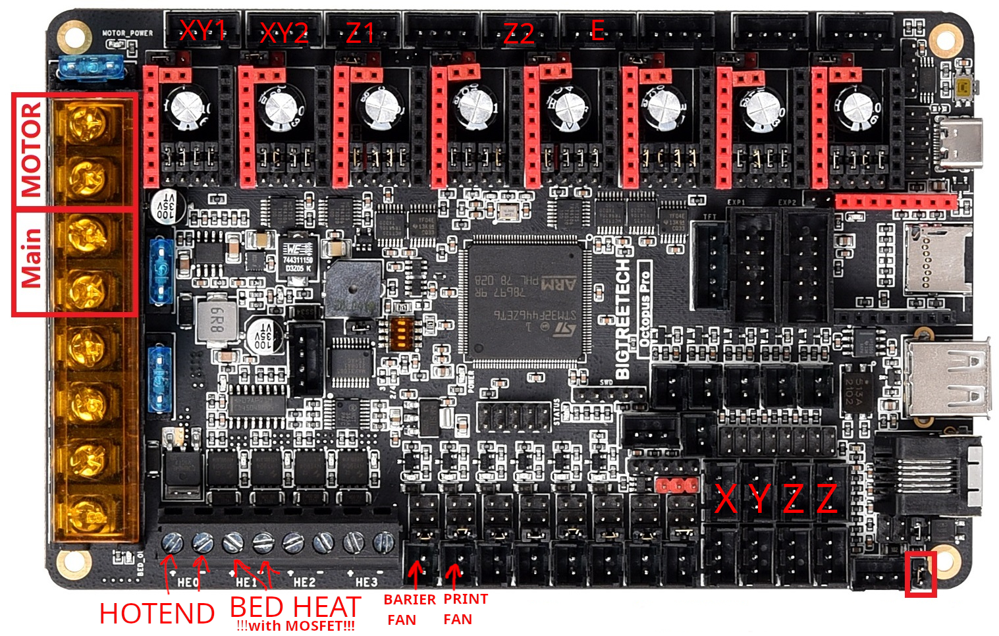

# DISCLAIMER

Автор данного мануала не несет отвественности за возможные поломки вашего принтера и т.п. Все делается на свой страх и риск.

Прежде чем отключать кабели от старой платы, обязательно промаркируйте их, чтобы потом было легче подключать.

Некоторые кабели могут потребовать обжима в разьем jst xh2.54 (например, вентилятор барьера). 

Так же в зависимости от того, где вы будете располагать плату, может потребоваться удлинение всех кабелей.

В своем подключении я использую штатаный мосфет для работы с грелкой стола.

# Полезное

https://docs.duet3d.com/User_manual/Reference/Gcodes - дока по gcode RRF

https://teamgloomy.github.io/btt_octopus_pro_1.0_f429_general.html - мануал по установке от teamgloomy

https://teamgloomy.github.io/btt_octopus_pro_1.0_f429_pins.html - инфа по именам пинов на плате

https://github.com/bigtreetech/BIGTREETECH-OCTOPUS-Pro - офф доки от BTT по Octopus Pro

https://github.com/gloomyandy/RepRapFirmware/releases - релизы прошивок

https://github.com/Duet3D/DuetWebControl/releases - релизы веб интерфейса


# Компоненты 

- Плата Octopus pro 429
- Драйверы BTT TMC2209 v1.2. Vref XY1: 1.2; XY2: 1.2; Z1: 0.8; Z2: 0.8; E: 0.5
- Экран BTT LCD Mini 12864 v1.0
- WIFI модуль  ESP8266, но так же можно использовать ESP32, нужно будет заменить прошивку в SD_CONTENT/firmware/DuetWifiServer.bin на https://github.com/gloomyandy/DuetWiFiSocketServer/releases/download/v1.27-02/DuetWiFiServer-esp32-stm32-1.27-02.bin ( не забудьте переименовать скачаный файл в DuetWifiServer.bin)

# Схема подключение реборна к плате

Octopus pro 429 распиновка




## Подключение моторов:


- XY1 motor: MOTOR0 pin
- XY2 motor: MOTOR1 pin
- Z1 motor: MOTOR2_1 pin
- Z2 motor: MOTOR3 pin
- E motor: MOTOR4 pin

## Подключение концевиков:

- X endstop: PG6 pin
- Y endstop: PG9 pin
- Z1 endstop: PG10 pin
- Z2 endstop: PG11 pin

Возможно концевики по Z надо будет поменять местами, если стол будет херово ездить

# Прошивка

## Подготовка SD карты

Форматируем флешку, размер сектора обязательно 512 байт

- Если карта меньше 4гб, то FAT16
- Если карта от 4 до 31гб, то FAT32

SD_CONTENT/sys/config.g

В строке меняем PASS на любой пароль, это будет пароль для веб интерфейса

`M551 P"PASS" ` 

SD_CONTENT/sys/config.json

ищем строки и меняем в них данные на свои

```
      "password":"PASS",
      "ssid":"WIFI_SSID",
      "ssid_password":"WIFI_PASS",
 ```

Копируем все !содержимое! папки SD_CONTENT прямо в корень флешки

## Устанавливаем софт
Устанавливаем хрень для подключение к плате:

`sudo apt install screen`

Конектимся к плате (на вашей системе адрес может отличаться)

`sudo screen /dev/ttyACM0 9600`

## Шьем
Выполняем пару команд для прошивки wifi модуля и основной прошивки

```
	M552 S0
	M997 S1
	M552 S0
	M587 S"WIFI_SSID" P"WIFI_PASS"
	M552 S1
```

# Правки в конфиг

Правки в конфиг необходимо делать только в том случае если у вас моторы катаются не в те стороны


## Реверс концевиков

По умолчанию у меня все концевики реверснуты

Убираем "!" перед именем пина концевика, если нужно

```
	M574 X1 S1 P"!xstop";
	M574 Y1 S1 P"!ystop";
	M574 Z1 S1 P"!zstop+!e0stop"; double Z endstop
```

## Реверс моторов

S0 backward / S1 frontward

```
	M569 P0 S0; XY1 motor
	M569 P1 S0; XY2 motor
	M569 P2 S0; Z1 motor
	M569 P3 S0; Z2 motor
	M569 P4 S0; E motor
```

# Калибровки

Изначально в конфиге будет присутствовать калибровка для хотенда и кровати, если с этими значениями будет фейлится прогрев, делаем клибровку

## Калибровка хотенда

Выполняем команду для запуска калибровки, займет некоторое время (у меня 373 seconds), P1 - полная мощность, A25 - окружающая температура

`M303 H0 S230 P1 A25 Q0;`

Дожидаемся окончания калибровки, по ее окончанию в консоли будет выведена строка для сохранения в config.g (нужно заменить существующую !M307 H0! )

`M307 H0 R2.497 K0.277:0.000 D7.10 E1.35 S1.00 B0 V24.0`


## Калибровка кровати

Выполняем команду для запуска калибровки, займет некоторое время (у меня 1320 seconds), P1 - полная мощность, A25 - окружающая температура

`M303 H1 S70 P1 A25 Q0;`

Дожидаемся окончания калибровки, по ее окончанию в консоли будет выведена строка для сохранения в config.g (нужно заменить существующую !M307 H1! )

`M307 H1 R0.376 K0.353:0.000 D15.89 E1.35 S1.00 B0`
