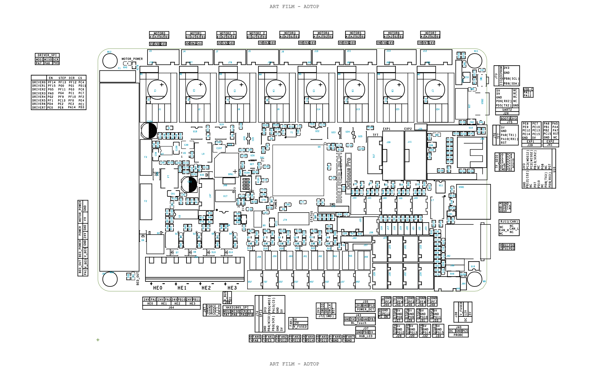
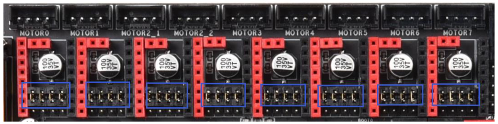

#Схема подключение реборна к плате

Octopus pro 429 распиновка

##Подключение моторов:

- XY1 motor: MOTOR0 pin
- XY2 motor: MOTOR1 pin
- Z1 motor: MOTOR2_1 pin
- Z2 motor: MOTOR3 pin
- E motor: MOTOR4 pin

##Подключение концевиков:

- X endstop: PG6 pin
- Y endstop: PG9 pin
- Z1 endstop: PG10 pin
- Z2 endstop: PG11 pin

Возможно концевики по Z надо будет поменять местами, если стол будет херово ездить

#Прошивка

##Подготовка SD карты

TODO

##Устанавливаем софт
Устанавливаем хрень для подключение к плате:

`sudo apt install screen`

Конектимся к плате (на вашей системе адрес может отличаться)

`sudo screen /dev/ttyACM0 9600`

##Шьем
Выполняем пару команд для прошивки wifi модуля и основной прошивки

<code>
	M552 S0

	M997 S1

	M552 S0

	M587 S"WIFI_SSID" P"WIFI_PASS"

	M552 S1
<code>

#Правки в конфиг

Правки в конфиг необходимо делать только в том случае если у вас моторы катаются не в те стороны

##Инверс концевиков

По умолчанию у меня все концевики заинверсены

Убираем "!" перед именем пина концевика, если нужно

<code>
	M574 X1 S1 P"!xstop";

	M574 Y1 S1 P"!ystop";

	M574 Z1 S1 P"!zstop+!e0stop"; double Z endstop
<code>

##Инверс моторов

S0 backward / S1 frontward

<code>
	M569 P0 S0; XY1 motor

	M569 P1 S0; XY2 motor

	M569 P2 S0; Z1 motor

	M569 P3 S0; Z2 moto

	M569 P4 S1;  E motor
<code>

#Калибровки

Изначально в конфиге будет присутствовать калибровка для хотенда и кровати, если с этими значениями будет фейлится прогрев, делаем клибровку

##Калибровка хотенда

Выполняем команду для запуска калибровки, займет некоторое время

`M303 H0 S240;`

Дожидаемся окончания калибровки, по ее окончанию в консоли будет выведена строка для сохранения в config.g (нужно заменить существующую)

`M307 H1 R2.497 K0.277:0.000 D7.10 E1.35 S1.00 B0 V24.0`

##Калибровка кровати

Выполняем команду для запуска калибровки, займет некоторое время

`M303 H0 S70;`

Дожидаемся окончания калибровки, по ее окончанию в консоли будет выведена строка для сохранения в config.g (нужно заменить существующую)

`M307 H0 R0.376 K0.353:0.000 D15.89 E1.35 S1.00 B0`

